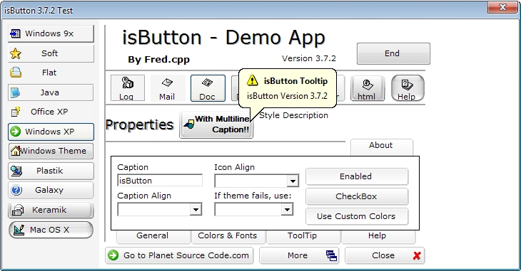



## isButton 3\.7\.2 the multi style button \(update\)

### Description

isButton 3.7.2 - update (original v3.6.2 by Fred.cpp)

Reported bugs fixed:

Click event fires when button is disabled.
 
### More Info
 

             |
---                |---
**Submitted On**   |2008-10-09 17:03:52
**By**             |[David Cunha](https://github.com/Planet-Source-Code/PSCIndex/blob/master/ByAuthor/david-cunha.md)
**Level**          |Advanced
**User Rating**    |5.0 (30 globes from 6 users)
**Compatibility**  |VB 6\.0
**Category**       |[Custom Controls/ Forms/  Menus](https://github.com/Planet-Source-Code/PSCIndex/blob/master/ByCategory/custom-controls-forms-menus__1-4.md)
**World**          |[Visual Basic](https://github.com/Planet-Source-Code/PSCIndex/blob/master/ByWorld/visual-basic.md)
**Archive File**   |[isButton\_32129931092008\.zip](https://github.com/Planet-Source-Code/david-cunha-isbutton-3-7-2-the-multi-style-button-update__1-70247/archive/master.zip)

### API Declarations

Many

